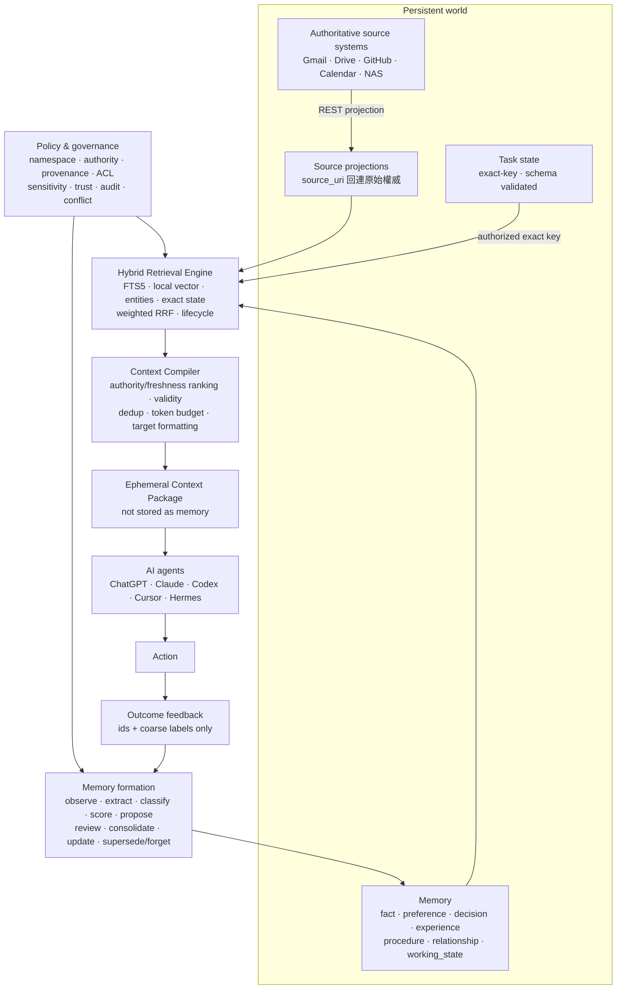

# ContextHub

部署在私人 NAS 的**跨 AI Context Control Plane**：連接來源 app 的權威投影、管理可長期重用且受治理的 Memory，並依每次任務動態編譯短暫的 Context Package。Codex、Claude Code、個人／工作 Hermes 共用同一套使用者所擁有的 context domain，不綁定單一 AI 廠商。

**Memory 是持久資訊；Context 是某次推論看到的短暫組合。** 對 AI Memory，SQLite 是唯一權威；對 Gmail／Drive／GitHub／Calendar 等 app 資料，ContextHub 只保存 AI 決策所需的投影與 `source_uri`，原始資料仍留在來源系統。個人與工作 namespace 嚴格隔離，agent 記憶經 `candidate → accepted` 才能進共享讀取面，所有讀寫、版本與衝突裁決都可追溯。

一般使用者的查看、審核與記憶遷移說明見
[docs/USER-GUIDE.md](docs/USER-GUIDE.md)；可直接交給 AI agent 的操作與既有記憶
遷移說明見 [docs/AGENT-GUIDE.md](docs/AGENT-GUIDE.md)。完整設計見
[docs/DESIGN.md](docs/DESIGN.md)；未來功能與平台工作排序見
[docs/BACKLOG.md](docs/BACKLOG.md)；信任邊界與資料治理見
[docs/ADR-001](docs/ADR-001-trust-boundary.md)；Context／Memory 分層決策見
[docs/ADR-002](docs/ADR-002-context-memory-separation.md)；v6 混合查找決策見
[docs/ADR-003](docs/ADR-003-hybrid-memory-retrieval.md)。



Agent runtime 仍負責 system/user instructions 與即時 tool output 的最後 prompt 組裝；ContextHub 的 `compile_context` 專注於持久來源、Memory 與明確授權的 operational state，不保存 task text 或編譯結果。

## 本機開發

```bash
nvm use
npm ci
npm test          # tsc typecheck + vitest(隔離/信任/政策/稽核/一致性/還原邊界)
npm run benchmark:retrieval -- --items=2000 # 60-case Recall@5/Success@1/MRR + p50/p95
npm run dev       # http://localhost:8787
npm run e2e       # 真實 HTTP 端對端:REST↔MCP 一致性 → 備份 → 還原 → reindex → 驗證
```

## 開通 clients(一 key 一 namespace)

```bash
# AI 工具(agent):寫入一律 candidate,經你審核才成為共享事實
npm run cli -- create-client --id claude-code-personal --name "Claude Code(個人)" \
  --namespace personal --principal-kind agent --profile agent-default
npm run cli -- create-client --id hermes-personal --name "Hermes 秘書" \
  --namespace personal --principal-kind agent --profile agent-default --max-sensitivity private
npm run cli -- create-client --id codex-personal --name "Codex" \
  --namespace personal --principal-kind agent --profile agent-default

# 來源 app(service):自己投影的可信 producer(policy-accepted)
npm run cli -- create-client --id finance-app --name "財經管理App" \
  --namespace personal --principal-kind service --profile app-producer

# 你自己的審核憑證(human):日常審核不要用 ADMIN_TOKEN
npm run cli -- create-client --id tim-reviewer --name "Tim(審核)" \
  --namespace personal --principal-kind human --profile reviewer

# 工作 namespace:deny-by-default,建了 client 還要在政策裡明確 allowlist
npm run cli -- create-client --id hermes-work --name "Hermes(工作)" \
  --namespace work --principal-kind agent --profile none
npm run cli -- policy-show --namespace work > /tmp/work-policy.json   # 編輯 rules 後:
npm run cli -- policy-apply --namespace work --file /tmp/work-policy.json
```

要點:namespace 與 principal-kind **必填**(fail-closed);同一工具要碰個人+工作就發兩把 key、設兩個 MCP 連線;`--profile` 是顯式的政策升版(被稽核),`none` 表示零權限待手動授權;key 外洩用 `rotate-key --id <client>`(身分與稽核連續性保留)。work namespace 只放抽取後摘要/task,禁原文——見 ADR-001。

## NAS 部署

初次安裝可依下列 compose 步驟；既有 production 的正式升級不要手動組合 build/restart
命令，請使用 [NAS Deployment Runbook](docs/NAS-DEPLOY-RUNBOOK.md) 與
`scripts/nas-deploy.sh`。標準流程會從 clean Git archive build、先建立 verified manifest、
通過 read-only upgrade gate，才 recreate container，並自動執行 health、reindex、restore
drill、doctor 與 image rollback。

```bash
git clone <this repo> && cd ContextHub
cp .env.example .env
# ADMIN_TOKEN 設為新隨機值；CONTEXTHUB_BIND_ADDRESS 保持 127.0.0.1。
docker compose up -d --build

# Synology Tailscale 預設 userspace networking，Docker 不應直接綁 100.x IP。
# Data plane：讓 MCP 與 legacy key 介面走 tailnet 的 8788/TCP：
sudo /var/packages/Tailscale/target/bin/tailscale serve \
  --bg --yes --tcp=8788 tcp://127.0.0.1:8788
# Control Center：另用 HTTPS 8443，讓 Tailscale identity headers 可建立 Web session。
# 若 NAS 的 443 已由其他服務（例如 Hermes）使用，不要改動 443。
sudo /var/packages/Tailscale/target/bin/tailscale serve \
  --bg --yes --https=8443 http://127.0.0.1:8788

curl http://<nas-tailscale-ip>:8788/health   # redacted readiness + version/schema/model metadata
curl -k https://<nas-tailscale-name>:8443/health
docker compose exec contexthub node dist/cli.js reindex
docker compose exec contexthub node dist/cli.js retrieval-status
```

**備份**(每日 NAS 排程;WAL 下直接複製 `.db` 不是一致備份):

```bash
docker compose exec contexthub node dist/cli.js backup        # snapshot + checksum manifest → /data/backups/
docker compose exec contexthub node dist/cli.js doctor --json
docker compose exec contexthub node dist/cli.js restore-drill --snapshot /data/backups/<manifest>.json --json
docker compose exec contexthub node dist/cli.js idempotency-gc # 90 天 TTL 清理(每週)
```

Hyper Backup 指向 `backups/` 並開啟 client-side 加密。**還原演練**只在隔離副本執行:

```bash
docker compose exec contexthub node dist/cli.js restore-drill \
  --snapshot /data/backups/contexthub-<ts>.manifest.json --json
# 正式升級先執行 scripts/upgrade-gate.sh；rollback 優先回上一個 image
```

外出存取走 Tailscale,不開公網 port。ISP 固定公網 IP 不是必要條件；ContextHub
容器只綁 NAS loopback，再由 Tailscale Serve 私網轉送；不能綁 `0.0.0.0` 或 NAS
的公網 IP。

## Agent 端:接上 MCP

```bash
claude mcp add --transport http contexthub-personal http://<nas-tailscale-ip>:8788/mcp \
  --header "Authorization: Bearer chk_<personal的key>"
claude mcp add --transport http contexthub-work http://<nas-tailscale-ip>:8788/mcp \
  --header "Authorization: Bearer chk_<work的key>"     # 連線即 namespace 邊界
```

Codex 的安全設定、personal/work credential 隔離與 smoke test 見
[docs/CODEX.md](docs/CODEX.md)。

## Control Center（Tailscale HTTPS）

Control Center 是 feature-flagged 的人類管理平面：`/dashboard`、`/memories`、`/review`、`/agents`、`/namespaces`、`/policies`、`/audit`、`/settings`。它使用 Tailscale Serve 的 identity headers 建立短期、可撤銷的 `HttpOnly; Secure; SameSite=Strict` session；瀏覽器不保存 reviewer key，也不會取得 `ADMIN_TOKEN`。Control admin 與 namespace-scoped human reviewer 是分離的，沒有 linked human client 就不能讀 Memory。

先在 NAS 以 CLI bootstrap：

```bash
docker exec contexthub node dist/cli.js web-principal-add \
  --provider tailscale --subject <TAILSCALE_USER_LOGIN> --name "Owner" --control-admin
docker exec contexthub node dist/cli.js web-principal-link \
  --subject <TAILSCALE_USER_LOGIN> --client tim-reviewer-personal
```

管理頁網址是 `https://<nas-tailscale-name>:8443/dashboard`；請使用 Tailscale DNS 名稱，不要用 `https://<tailscale-ip>:8443` 取代，因為 HTTPS 憑證與 identity proxy 都以 tailnet hostname 為準。只有在 Tailscale HTTPS reverse proxy 已配置後才開啟 `CONTROL_CENTER_ENABLED=true`、`CONTROL_CENTER_TAILSCALE_AUTH_ENABLED=true`、`CONTROL_CENTER_TRUSTED_PROXY=true`，並填入 `CONTROL_CENTER_CANONICAL_ORIGIN=https://<tailnet-host>:8443`。Enrollment 預設關閉；開啟 `AGENT_ENROLLMENT_ENABLED=true` 後，Agents 頁面可產生 single-use code，agent 透過 `/v1/agent-enrollment/exchange` 取得一次性 raw key。MCP OAuth 已有 protected-resource 驗證接縫，但未經真實 issuer/客戶端實測不宣稱 live 支援；`LEGACY_API_KEYS_ENABLED=true` 是相容 fallback。

21 個工具。讀取面：`compile_context`（依 intent、有效期、authority/freshness、ACL 與 token budget 產生短暫 package）、`search_context`（預設 hybrid：FTS5 + 本地向量 + structured entity，weighted RRF；結果帶 retrieval diagnostics、information_class/memory_kind/authority/trust_state）、`curation_suggestions`（只讀的 duplicate/conflict/stale/expired working_state 建議）、`get_changes`、`traverse_entity_graph`、`get_current_context`、`get_recent_context`、`get_context_item`、`get_context_brief`、`list_context_sources`、`get_memory_history`（版本＋裁決史）、`my_candidates`（自己的待審）。

`search_context` 與 `compile_context` 支援 `information_classes`、`memory_kinds`、`entity_filters` 硬過濾；`entities` 仍是 query-time boost。REST `GET /v1/items` 對應 `information_class`、`memory_kind`、`entity_exact`。Tags 與 entities 會以 NFKC、空白、大小寫及重複值正規化；`context_items` 仍是唯一權威，`item_tag_index`／`item_entity_index` 是 migration v9 建立的可重建 projection。

v6 的 `local-feature-hash-v1` 是完全本地、同步、可重現的 384 維 similarity embedding，擅長 typo／字形近似與欄位加權；它不宣稱具備大型神經模型的同義詞理解。embedding provider 可替換成另一個同步 on-device model，而 ACL、domain rows 與 API 不需改變。`item_embeddings`、FTS 與 normalized tag/entity facets 都只是 projection；SQLite `context_items` 仍是唯一權威。

記憶與回饋生命週期：`save_memory`（必須明確標記 fact／preference／decision／experience／procedure／relationship／working_state）、`propose_insight`（推論＋evidence）、`revise_my_candidate`、`propose_successor`（取代過時的 accepted Memory，裁決原子寫回）、`record_context_outcome`（只記 context 是否改變行動及粗粒度結果）、`operate_task`、`curate_note`、`update_operational_state`／`get_operational_state`（exact-key 狀態槽）。

`context_items.information_class` 由 server 決定為 `source / memory / task_state`；`memory_kind`、`valid_from / valid_until`、`last_verified_at`、`decay_policy` 描述 Memory 的語意與生命週期。`valid_until`／`expires_at` 已過或尚未到 `valid_from` 的項目，不進任何 list/search/compiler 讀取面。

所有 mutation 必帶 `idempotency_key`(UUID)——timeout 重試安全,同 key 回原結果。

## 審核 agent 的記憶提案

```bash
npm run cli -- candidates                          # 待審 inbox
npm run cli -- review --id 01K... --action accept --revision 1 --note "確認屬實"
npm run cli -- review --id 01K... --action reject --revision 1 --note "單次行為"
npm run cli -- review --id 01K... --action revoke --revision 3 --note "已不成立"
npm run cli -- audit --namespace work --limit 50   # 稽核軌(讀/寫/拒絕/管理)
```

Human reviewer 若使用 legacy data plane，可從 Tailscale 私網開啟 `http://<NAS_TAILSCALE_IP>:8788/review`，
貼上該 namespace 的 reviewer key 進行 inbox、歷史、接受與拒絕操作；key 只留在當前頁面的記憶體，
不會寫入 localStorage。REST 介面仍是 `POST /v1/items/:id/review`。被拒的提案 agent 可用 id
讀到 `review_note`;接受 successor 會原子地把舊記憶標為 superseded(裁決寫回 hub)。

已啟用 Control Center 時，日常管理請改用
`https://<nas-tailscale-name>:8443/dashboard`，由 Tailscale identity 登入，不需要貼 reviewer key。

已接受的內容可從 `http://<NAS_TAILSCALE_IP>:8788/explore` 視覺化查看：來源與類型分布、
搜尋／篩選、完整內容與 provenance。此頁同樣使用 namespace 專屬的 read/reviewer key，
只顯示 server-side policy 授權可讀的 accepted items。

## ADMIN_TOKEN 管理

- token **只存在 NAS 上的 `.env`**(`.gitignore` 已排除),絕不寫進 repo、文件或訊息。
- 產生/輪替:NAS 上 `sed -i "s/^ADMIN_TOKEN=.*/ADMIN_TOKEN=$(openssl rand -base64 32)/" .env && docker compose up -d`,舊 token 立即失效。
- 曾出現在任何檔案、剪貼簿或對話中即視同外洩,立即輪替。日常審核用 human reviewer key,不用 admin token。

## 專案結構

```
src/
  core/    # 單點強制層:commands(mutation+稽核+idempotency)、context-compiler(短暫 package)、
           #   items-repo(applyFilters:namespace+trust+ACL+validity)、policy/policies-repo、audit-repo、
           #   local-embedding(pluggable on-device provider)、clients-repo、canonical、cjk、errors
  http/    # Fastify:auth + /v1 routes(items/candidates/review/task-op/curate/state/
           #   history/audit/policies/clients/namespaces)+ /explore + /review
           #   + Control Center + health
  mcp/     # MCP server(21 tools)+ Streamable HTTP 掛載(stateless,一 key 一 namespace)
  db/      # SQLite+sqlite-vec 連線(synchronous=FULL、instance lock)+ migrations(v1–v14)
  cli.ts   # create-client/.../reindex/retrieval-status/backup/purge/...
scripts/   # retrieval-benchmark.ts、e2e.sh、restore.sh(NAS runbook)
test/      # 100+ tests:隔離/信任/政策/稽核 fail-closed/idempotency/一致性/還原邊界
docs/      # USER-GUIDE、AGENT-GUIDE、CODEX、DESIGN、ADR-001/002/003
```
