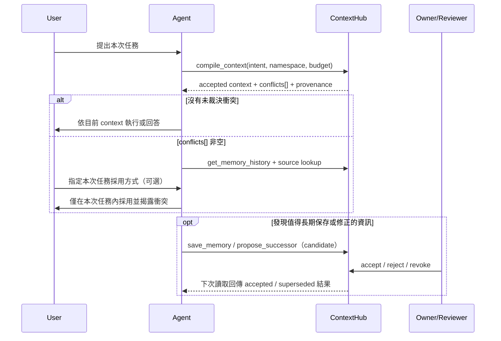

# Agent Memory Federation Protocol v1

Evidence status:

- `implemented_local`：schema v15、REST/MCP contract 與本機相容性測試已完成。
- `live_verified`：`0.9.0@3ef8f8ce40a7d2746de31b44b00562d56e38fe20` 已以 immutable digest 部署至 NAS，schema 15、health、reindex、restore drill、doctor 與 rollback evidence 通過。
- `provider_verified`：真實 Codex、Claude、Hermes product client 的完整 federation smoke 仍待分別執行；不得由本機 MCP SDK 測試或 production health 反推。

Protocol id: `contexthub-agent-memory-federation/v1`

## 1. AI agent 與 ContextHub 的責任邊界

AI agent 內建的 memory 與 ContextHub 不是兩套平行真相。兩者分工如下：

| 層級 | 責任 | 是否為共享權威 |
|---|---|---|
| 來源系統 | Gmail、GitHub、Calendar、NAS、業務 app 的原始資料 | 是；針對其原始 domain |
| ContextHub | 已接受的跨 agent 長期 Memory、版本、provenance、裁決與 namespace 邊界 | 是；針對 AI 共享記憶 |
| Agent local memory | 單一產品／workspace 的操作習慣、暫存指標與尚待提案內容 | 否 |
| Context Package | 某次任務經 ACL、有效期、衝突與 token budget 過濾後的輸入 | 否；是短暫編譯結果 |

因此，Codex、Claude、Hermes 可以保留各自的 local memory 管理機制，但不得把 local copy 當成比 ContextHub 更新或更可信的共享事實。ContextHub 也不取代 agent runtime 的 system/user instructions、工作目錄規則與即時 tool output。

## 2. Agent 與 ContextHub 的協作原則（normative）

協作時必須把「本次任務怎麼做」與「長期記憶怎麼改」分開。當前使用者可以在不違反 system/security/policy 的前提下指示本次任務採用哪個資訊；這不等於 agent 已獲授權改寫 shared Memory。長期變更仍走 candidate、successor 與 review。

| 層級 | 對本次任務的作用 | 對長期記憶的作用 |
|---|---|---|
| System/security、repository rules、namespace policy | 不可繞過的硬限制 | 限制什麼可以讀、寫、審核；本身不因一次對話被改寫 |
| 當前使用者明確指令 | 在硬限制內主導本次 action | 可成為提案依據，但不會由 agent 自動升格為 accepted Memory |
| ContextHub accepted Context | 提供跨 session、跨 agent 的受治理背景 | 是 AI shared Memory 的 current surface；版本與裁決留在 hub |
| Agent local memory | 提供單一 agent/workspace 的局部操作提示 | 永遠不是 shared winner，只能 local-only、pointer 或 candidate staging |

所有相容 agent 必須遵守以下原則：

1. **先取用、後推理**：每個新 session 或新任務先向 ContextHub 取得與 intent 相符的 context，不把模型參數、舊 prompt 或 local cache 當成最新 shared state。
2. **最小必要揭露**：只編譯本次任務需要、目前 credential 可讀且未失效的內容；不把整個 namespace、完整對話或 Context Package 複製到 local memory。
3. **保留來源，不洗白 provenance**：來源 app 對原始 domain 負責；ContextHub 對 shared AI Memory 的 acceptance/history 負責；agent 必須保留 `authority`、`source_uri`、trust 與 revision 的差異。
4. **寫入是提案，不是宣告真理**：agent 新發現的 durable fact、preference 或 decision 以 `save_memory`／`propose_insight` 進入 candidate lifecycle；寫入成功只代表提案被記錄。
5. **修正走 successor，不覆寫 accepted Memory**：已接受內容過時時，以 `propose_successor` 指向 predecessor；review 前舊 item 仍是 current，接受後才原子 supersede。
6. **衝突必須顯性、fail-closed**：`conflicts[]` 非空時，不以 local memory、時間、authority 或分數自行選 winner；先查 history/source，必要時依使用者指示完成本次任務，再提出長期修正。
7. **Local cache 可丟棄**：cache 只保存 pointer metadata；revision、cursor、ACL、revocation 或 successor 改變時重新讀 hub。離線時不得宣稱 cached content 仍是最新。
8. **Namespace 與 credential 最小權限**：personal/work 使用不同 credential，最好使用不同 profile/process；agent 不得從 payload 指定或跨越 namespace。
9. **每次 mutation 可安全重試且可稽核**：新的邏輯操作使用新的 UUID；只有 timeout/retry 同一操作才重用 idempotency key。不得把 secret、原始 prompt 或完整內容塞進 log/audit metadata。
10. **人類裁決閉環**：agent 可以提出、補證據與說明影響，但不得 self-review 或 self-accept；review 結果由 ContextHub 寫回 history，後續所有 agent 重新讀取同一裁決。

共同工作循環如下：



## 3. Local memory 的三種合法模式

Agent 必須把每一筆 local memory 分為且只分為下列其中一種：

| mode | 用途 | 可保存內容 |
|---|---|---|
| `local_only` | 只對目前 agent／workspace 有意義，且不應跨 agent 共享 | 本地操作規則或短期工作狀態；不可宣稱為共享事實 |
| `cache_pointer` | 指向 ContextHub 的讀取快取 | 只能保存 `hub_item_id`、`revision`、`change_cursor`、`cached_at` |
| `shared_candidate` | 值得跨 agent 長期保存、但尚未裁決的提案 | 本地可暫存提案狀態；正式內容必須透過 `save_memory`／`propose_successor` 進入 hub candidate lifecycle |

`cache_pointer` 不得保存 title、content、data、embedding 或完整 Context Package。需要內容時重新向 ContextHub 讀取，讓 ACL、trust、validity、successor 與 revocation 每次都生效。

## 4. Session 與 cache refresh

Agent 每次建立 ContextHub session 時：

1. 讀取 MCP server instructions，確認 protocol id 與目前 namespace。
2. 以 `compile_context` 取得任務所需的 accepted context；catch-up 才使用 brief/search。
3. 若本地保存 `change_cursor`，呼叫 `get_changes(after=<cursor>)`。
4. 對每個 `cache_pointer` 比較 revision；需要時以 item id 重新讀取。若 item 已不可讀，刪除本地 pointer，不沿用舊內容。
5. 保存回傳的 `next_cursor`，即使本頁沒有可見 event 也要前進。

一般 accepted-memory reader 的 change feed 只回傳其 namespace／ACL 可見的 accepted items、自己的 candidate，以及曾可見項目的失效事件；別的 agent 尚未接受的 candidate 不會藉由 cursor feed 洩漏。具明確 `change.read` capability 的維運 client 是不同的 privileged surface。

範例：

```json
{
  "protocol": "contexthub-agent-memory-federation/v1",
  "cache_pointer": {
    "hub_item_id": "01K...",
    "revision": 4,
    "change_cursor": 381,
    "cached_at": "2026-08-20T04:00:00.000Z"
  }
}
```

## 5. `claim_key` 與單一 current winner

只有適合「同一 namespace 中目前應只有一個 winner」的 claim 才加 `claim_key`。格式為 2–12 個 slash-separated `kind:value` segments，NFKC 正規化並轉小寫：

```text
user:tim/preference:response_language/scope:contexthub
project:contexthub/decision:database_authority/scope:production
device:gnest/fact:tailscale_address/scope:personal
```

不要把 `claim_key` 用於可同時存在多筆的歷史事件、交易、日誌或經驗。Append-only transaction 明確拒絕 `claim_key`。Successor 省略 `claim_key` 時會繼承 predecessor 的 key，也可以在提案時明確改成新的 claim identity。

Schema v15 在 `context_items` 新增 nullable `claim_key`。REST `GET /v1/items?claim_key=...`、`POST /v1/context/compile`、MCP `search_context` 與 `compile_context` 都支援 exact claim filter。

## 6. 衝突處理

若同一 `claim_key` 同時有兩筆以上 active + accepted items，Context Compiler 必須：

- 把所有 claimant 從 `sections` 與 `rendered_context` 的事實內容排除；
- 回傳完整結構化 `conflicts[]`；
- 在 model-facing output 加入 bounded warning；
- 不以 freshness、authority、score 或 local memory 靜默選 winner。

```json
{
  "constraints": { "unresolved_claims_excluded": true },
  "omitted": { "conflict": 2 },
  "conflicts": [{
    "claim_key": "user:tim/preference:response_language/scope:contexthub",
    "status": "unresolved",
    "reason": "multiple_active_accepted_claims",
    "item_ids": ["01K...A", "01K...B"],
    "required_action": "inspect_history_and_adjudicate"
  }]
}
```

Agent 遇到衝突時必須依序：

1. 不猜、不引用 local memory 當 winner。
2. 呼叫 `get_memory_history`，並依 `source_uri` 或來源 app 核對原始證據。
3. 若使用者在目前對話給出明確指令，該指令可主導**本次任務**，但不能靜默改寫長期 Memory。
4. 需要長期修正時提出 `propose_successor`；不得自行接受。
5. 由 owner/reviewer 接受 successor、撤銷錯誤 claim，或以其他明確 review 決定完成裁決。

## 7. 相容性矩陣

| Target adapter | Session instructions | Cache pointer | Candidate | Successor | Conflict exclusion | Namespace isolation | Evidence |
|---|---|---|---|---|---|---|---|
| OpenAI／Codex (`openai`) | implemented_local | implemented_local | implemented_local | implemented_local | implemented_local | implemented_local | Vitest + MCP HTTP client |
| Claude (`anthropic`) | implemented_local | implemented_local | implemented_local | implemented_local | implemented_local | implemented_local | Vitest + escaped XML adapter |
| Hermes (`hermes`) | implemented_local | implemented_local | implemented_local | implemented_local | implemented_local | implemented_local | Vitest + MCP HTTP client |

本矩陣的 `implemented_local` 是以官方 MCP SDK client 對本機 ContextHub 執行 contract test，不等於三個產品的正式 client 與認證環境已完成 smoke。`provider_verified` 必須分別用真實 Codex、Claude、Hermes session 重新驗證 initialize、instructions、tools、cache refresh、candidate、successor、conflict 與 personal/work isolation。Federation v1 的 NAS release 已取得 deployment runbook 要求的 `live_verified` 證據，但這不會取代各 product client 的 provider verification。

自動化測試位於 `test/agent-memory-federation.test.ts`；migration v15 的 pre-migration snapshot、restore 與 reindex 覆蓋位於 `test/backup-restore.test.ts`。

## 8. 不在 v1 範圍內

- 不同步或刪除各產品既有 local memory store。
- 不把 ContextHub 變成完整 conversation archive。
- 不讓 agent 自動裁決 accepted conflict。
- 不把 personal/work credential 放進同一個 always-on runtime。
- 不把本機相容性測試標示成 provider 或 production 驗證。
