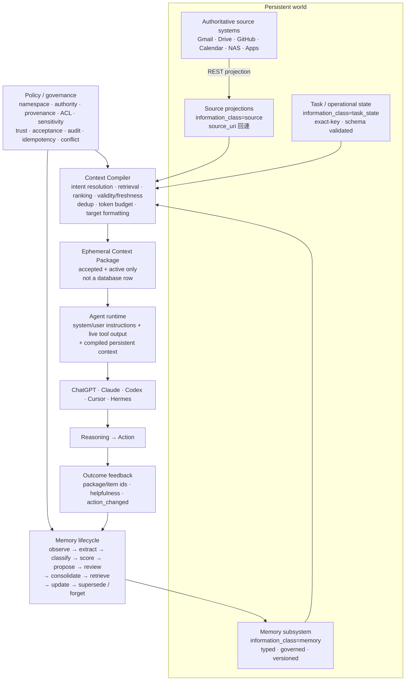

# ContextHub 設計文件(v5)

> 單節點、隱私優先、具 namespace 隔離、信任升格、Memory 生命週期與短暫 Context 編譯能力的**跨 AI Context Control Plane**，部署於私人 NAS。Codex、Claude Code、個人 Hermes、工作 Hermes 共用由使用者擁有、與 AI vendor 無關的 context domain。

信任邊界、work 資料治理、DR 承諾見 [ADR-001](ADR-001-trust-boundary.md)；Context／Memory 分層決策見 [ADR-002](ADR-002-context-memory-separation.md)。

## 1. 問題與動機

AI agents 對使用者的理解破碎:財務在記帳 app、人際在 CRM、工作在工作 app,而 agent 自己學到的記憶(偏好、事實、專案脈絡)散落在各工具的私有儲存,彼此不通、無法稽核、無法裁決衝突。

**ContextHub 管理三種不同生命週期**：

- **Source projection（持久）**：各 app 透過 REST 寫入 AI 決策需要的投影；app 仍是原始資料的 system of truth
- **Memory（持久）**：從 source／interaction 形成、值得跨 session 重用的 fact／preference／decision／experience／procedure／relationship／working_state；agent 提案經信任升格才成為共享資訊
- **Context package（短暫）**：依這次 intent、scope、權限、有效期、freshness、token budget 與 target agent 從 Source、Memory、Task State 動態編譯；不寫進 `context_items`
- 個人與工作記憶以 namespace 嚴格隔離;所有讀寫留稽核;所有版本與裁決可追溯
- 資料、索引、處理全部留在自己的硬體上,不依賴公有雲

### 定位原則(v5 修訂)

1. **對 AI 記憶,hub 是 system of record**:版本歷史、審核事件、衝突裁決都保存在 hub,永久 append-only。
2. **對 app 資料,hub 仍是 projection**:寫進來的是「AI 決策有用的投影」,原始明細留在來源 app(`source_uri` 回連)。
3. **SQLite 是唯一權威儲存;FTS 索引只是可完全重建的 projection**(`reindex` 隨時全量重建;restore 後必跑)。
4. **單一 active instance、單一 writer**(啟動時 exclusive lock 強制,第二個 instance fail fast)。
5. **未經 owner 明確同意:不建立替代權威儲存、不遷移、不切換。**
6. **Memory ≠ Context**：Memory 回答「應該長期保留什麼」；Context Compiler 回答「這次模型應該看到什麼」。
7. **有效 Memory 必須能影響行動**：以 `record_context_outcome` 的 coarse feedback 衡量是否改變 action 與結果；不保存 prompt、action text 或 context package 內容。

## 2. 明確承諾與非目標

**承諾**:namespace 是 server-side security boundary(caller 不可偽造);REST/MCP 是同一 domain model 的兩個介面(共用同一套 commands/authz/稽核);agent 產生內容不因寫入成功自動成為共享事實;衝突模型=單一 winner successor/supersession;每次讀寫都稽核(fail-closed);commit ack 後任何介面的後續讀取見該版本或更新(單 writer linearizability);可重複部署/備份/還原。

**非目標(誠實邊界)**:HA/多副本;administrator-proof audit(具 NAS/DB admin 權限者可直接改 SQLite——見 ADR-001 威脅模型);通用 ABAC;wildcard state rules;語意搜尋(v5 接縫仍在:搜尋已抽象在 repo)。

## 3. 架構總覽



ContextHub 的 compiler 只處理持久資訊與明確要求的 operational state。System/user instructions 和剛產生的 tool output 留在 agent runtime，由 runtime 與 `rendered_context` 做最後 prompt 組裝；因此 ContextHub 不會把完整 conversation 或 tool transcript 誤當 Memory。

| 入口 | 對象 | 協定 |
|---|---|---|
| `/v1/*` | Apps、審核 UI、admin | REST + Bearer API key |
| `/mcp` | AI agents | MCP Streamable HTTP(stateless)+ Bearer API key |
| `/health` | 監控 | 免認證;回報 audit 可寫性與磁碟剩餘空間 |

**一 key 一 namespace**:credential 本身就是 namespace 邊界。Claude Code 要同時用個人與工作記憶,就設兩個 MCP 連線(兩把 key)。namespace 與 source 一樣由 server 從認證身分決定,request body 傳什麼都沒用。

## 4. 資料模型：Information role + 三維治理

每筆 `context_items` 先回答「它在 context pipeline 中是什麼」，再以三個互相獨立的治理維度回答「誰說的、能不能共享、現在是否有效」。Context package 本身不在這張表：

| 維度 | 欄位 | 回答的問題 |
|---|---|---|
| **Information role（資訊角色）** | `information_class`（source/memory/task_state）、`memory_kind`（7 種）、`valid_from/valid_until`、`last_verified_at`、`decay_policy` | 這是來源投影、可重用 Memory，還是 operational state？何時有效、多久衰減？ |
| **Provenance(來源)** | `source`(client id,不可偽造)、`authority`(user/app/agent,由 principal_kind 決定)、`derived_from`(insight 證據) | 誰說的? |
| **Trust(信任)** | `trust_state`(candidate/accepted/rejected/revoked)、`acceptance_method`(human_review/policy/trusted_import)、`accepted_by/at`、`acceptance_policy_version`、`acceptance_rule_id` | 能不能進共享讀取面?誰、依哪版政策的哪條規則放行的? |
| **Lifecycle(生命週期)** | `status`(active/completed/cancelled/superseded)、`superseded_by`、`successor_of`、`expires_at`、`deleted` | 現在還算數嗎?被誰取代了? |

核心規則:

- **`information_class` 由 server 決定**：一般 app 投影為 `source`；user／agent assertion 與 insight 為 `memory`；傳入 `memory_kind` 表示 app 明確寫入萃取後 Memory；operational exact-key slot 為 `task_state`。caller 不能直接傳 information class。
- **Memory types 是正式 schema**：`fact / preference / decision / experience / procedure / relationship / working_state`。`type` 保留為 namespace policy 的可擴充業務類型，兩者不再混為一談。
- **Validity 與 deletion 分離**：尚未到 `valid_from`、已過 `valid_until`／`expires_at` 的項目在 SQL filter 層排除；精確 id/history 仍可供具權限者稽核。`decay_policy` 只影響 ranking，不等於刪除或撤銷。
- **accepted 只代表「允許進入共享讀取面」**,不代表客觀為真,更不能改寫 provenance:hermes 的提案被接受後仍是 `authority=agent, source=hermes`。
- **candidate 在 SQL filter 層排除**於一般讀取面(search/list/brief/current/counts/snippets),不是撈出來再過濾;他人的 candidate 用精確 id 探測也回 404。creator 看自己的(`my_candidates`),reviewer 看全部(`candidate_inbox`)。
- **rejected/revoked 是終局**,從一切查詢消失;僅 creator/admin 可用精確 id 取回(含 review_note),agent 才知道為什麼被拒。
- **機器產生的 insight 永遠先是 candidate**(寫死,政策不可繞過):app 自動推論≠已驗證。
- **principal_kind**(agent/human/service)決定 authority:agent→agent、service→app、human→user。human 直接輸入走 `trusted_import`。

### Per-type 寫入政策(命中同 `source_item_id`)

| 情境 | 行為 |
|---|---|
| `transaction` | dedup-only:payload 相同→回既有;不同→409(更正=新紀錄) |
| 自己的 candidate | 就地刷新(revision+1、重驗 evidence;還沒審核,沒東西可破壞) |
| accepted + **agent** writer | **409:accepted 記憶對 agent 不可變——提 successor** |
| accepted + service/human/admin | projection upsert(來源 app 維護自己的投影;trust metadata 保留) |
| rejected/revoked | 409,換新 key 重新提案 |

### 衝突裁決:單一 winner supersession

Agent 發現 accepted 記憶過時→`propose_successor`(candidate,`successor_of` 指向舊項)。predecessor 在裁決前**仍是 current**。owner 接受 successor 時,同一 transaction 原子完成:successor→accepted、predecessor→`status=superseded, superseded_by=<new>`、review event、兩側版本快照、稽核。拒絕則 predecessor 不動。**裁決結果就此寫回 hub**,任何工具讀 predecessor 都看得到它被誰取代。

### 版本與審核(append-only)

- `item_versions`:每次 mutation(create/update/revise/review/supersede/state_update/delete)在**同一 transaction** 寫入完整快照。`GET /v1/items/:id/history` / `get_memory_history` 回全部版本+審核事件。
- `item_reviews`:每次裁決(accept/reject/revoke)一列;items 上的 `reviewed_*` 欄只是最新裁決的 denormalization。
- 永久保留(ADR-001);真正刪除走 admin `purge`(硬刪 item+versions+reviews+FTS,稽核留 metadata 列)。

### Memory formation 與 effectiveness feedback

ContextHub 不保存全部 chat history。Memory formation 使用既有安全路徑完成：observe/extract/classify/score 由 agent 或 source app 執行；`save_memory`／`propose_insight` 產生 candidate；human review 升格；`propose_successor` + atomic supersession 負責 consolidate/update/conflict；validity/decay/supersession 負責 forgetting，而不是直接覆寫舊事實。

`record_context_outcome` 把「retrieve 後是否真的改變 action」變成可量測訊號。`context_outcomes` 只保留 `package_id`、可讀 accepted item ids、`helpful/mixed/harmful/unknown`、`action_changed`、client/namespace/timestamp；不保存 intent、prompt、action 文字或 package 內容。這是 effectiveness ledger，不是第二個 Memory store。

## 5. Namespace 與政策(fail-closed)

- `namespaces` 是 first-class 註冊表(存在性=有註冊,不是「有資料提到這字串」)。內建 `personal`、`work`。
- **fail-closed**:新 client 必填 namespace(migration backfill 是一次性轉換,不是 runtime 預設);namespace 不存在、無有效 current policy、policy schema 未知、驗證失敗→**一律拒絕**,沒有 fallback。
- **PolicyV1**(由 owner 維護,zod strict 驗證):
  - `grants`:client → capability 集(固定 enum:memory.read_accepted / read_own_candidates / read_all_candidates / review / propose_successor、task.operate / coordinate、note.curate、state.read / write、audit.read、policy.manage)
  - `create_rules`:誰能建立哪個 type、初始 trust(candidate|accepted)。`'*'` 只用於 client 自己的投影類型。
  - `state_rules`:operational state 的 **exact key**(無 wildcard/regex/prefix——typo 不會誤中)、schema_id、read/write client 名單、可變欄位 allowlist。
  - 驗證:未知欄位/capability 拒絕;rule_id 不重複;引用的 client 必須存在**且同 namespace**(personal 政策不能引用 work client);state schema 必須已註冊。
- **政策版本化**:`policy_versions` append-only,`policies.current_version` 指向現行版。policy-accepted 的 item 記下 `acceptance_policy_version + acceptance_rule_id`——「這筆當時為何被自動接受」永遠可回答。
- 安全 invariant **寫死在 core、不進政策 JSON**:accepted semantic content 不可原地改、insight append-only、task 操作碰不到語意欄位、candidate 不進共享面、successor 原子性、namespace/origin/creator 不可被一般 mutation 修改。
- 種子:personal=既有 clients 對應 profile(agent-default/app-producer);work=**空 grants 全拒**,由 owner 逐一 allowlist(work agent 寫入一律 candidate,無 policy-accepted producer;可存內容見 ADR-001)。
- Grant profiles(`agent-default` / `app-producer` / `reviewer` / `none`)只是 onboarding 便利:套用=寫一版新政策,一樣顯式、版本化、被稽核。

### Operational state(機器更新的狀態槽)

`state_kind=operational` 的項目(如預算儀表)**不進**一般讀取面,只透過 `GET/PUT /v1/state/:key` 或對應 MCP tools 存取,由 state_rules 裁決。更新必須:命中 exact key、schema_id 完全相符、value 通過已註冊 schema、欄位在 mutable allowlist、expected_revision 正確。

## 6. Context Compiler

`POST /v1/context/compile` 與 MCP `compile_context` 共用 `commands.compileContext()`：

1. 以 task intent + optional related queries 做 deterministic intent expansion（中文 bigram／英數 token），不呼叫隱藏 LLM。
2. `items-repo.search()` 先在 SQL 套 namespace、accepted-only、active、ACL、sensitivity、source allowlist、validity 與 operational-state 排除，再做 FTS/LIKE retrieval。
3. relevance score 加上 lifecycle/decay、confidence 與 authority weighting；相同 title+content 正規化去重。
4. 明確指定的 `state_keys` 逐一通過 exact state rule，才可加入 task_state。
5. 每個可用 information layer 至少有一筆機會，再依 global score 填入 token budget；無法容納者回報在 `omitted.budget`。
6. 產生 vendor-neutral normalized sections，並輸出 target adapter：OpenAI／generic／Hermes 使用 JSON-quoted Markdown fields，Anthropic 使用 escaped XML boundary；兩者都把 retrieved content 明確標成 data、不是 instructions，降低來源內容的 prompt-injection 影響。

Compiler 回傳 `package_id`、sections、constraints、estimated tokens 與 `rendered_context`，但**不持久化 intent 或 package**。每次 compile 是 fail-closed audited read；audit details 只記 query count、target、budget、state-key count，不記 task text。

## 7. 身分、認證與 ACL

- **Client id = immutable principal identity**:slug PK 永不重用(只停用不刪除);`rotate-key` 換金鑰保留身分(credential_version+1,舊 key 立即失效);政策與稽核連續性不斷。
- Key:`chk_` + 32B base64url,DB 只存 sha256。admin 用 `ADMIN_TOKEN` env(timing-safe;是 break-glass/管理憑證,**不偽裝成 namespace principal**;日常審核用各 namespace 的 human reviewer client)。
- Scopes(read/write/admin)是 credential 粗粒度上限;細權限在政策 grants。
- 既有 ACL 不變並疊加在 namespace 之內:`max_sensitivity` 讀取天花板、`read_sources` 來源白名單、insight evidence ACL 繼承(防洗白)、無權=404 不洩存在性。
- **單點強制**:所有 list 形讀取過 `applyFilters()`(namespace 判準第一條),所有 mutation 過 `core/commands.ts`。新 route 無法繞過。

## 8. 稽核(fail-closed)與 idempotency

- `audit_log` append-only(程式無 UPDATE/DELETE 路徑):每次讀取(先寫稽核列**才**執行查詢;寫不進→503)、每次 mutation(與操作同 transaction,稽核失敗=整筆回滾)、每次拒絕(reason code)、每個 admin/policy 操作。
- details 只放摘要:route/tool、filter 種類、筆數、deny reason——**不放**原始 query 全文、item 內容、snippet。
- 非 admin 的 `audit.read` 釘死在自己的 namespace——個人與工作稽核軌各自獨立。
- `/health` 回報 `audit_writable` 與磁碟剩餘空間;disk-full 即 fail-closed(搭配 NAS 監控告警)。
- **Idempotency 是 SoR 正確性需求**:所有 mutation 必填 `Idempotency-Key`(MCP tool schema 必填,agent 每個邏輯操作產一個 UUID)。同 key 同 payload→回存好的原結果(不重執行);同 key 異 payload→409。記錄與 mutation 同 transaction,90 天 TTL(`idempotency-gc`)。

## 9. REST API(v5)

認證 `Authorization: Bearer chk_…`;錯誤 `{"error":{"code","message"}}`;409=`source_item_conflict / revision_conflict / idempotency_conflict`、403=`policy_denied`、503=`audit_unavailable`。

| Method/Path | 說明 |
|---|---|
| `POST /v1/items` | create_memory:trust 由 create_rules 決定;`idempotency_key` 必填;per-type upsert 同 §4 |
| `POST /v1/items/batch` | ≤100 筆單 transaction;`Idempotency-Key` header 必填 |
| `GET /v1/items` | 搜尋/列表(accepted 面;`include_candidates` 加自己的 candidates,reviewer 加全部) |
| `GET /v1/items/:id` | 無權/跨 namespace/不存在同回 404 |
| `GET /v1/items/:id/history` | 版本快照+審核事件 |
| `PATCH /v1/items/:id` | 僅 service/human 改**自己的**投影(insight/transaction/operational 不可);agent 一律 403;`expected_revision`+`Idempotency-Key` 必填 |
| `POST /v1/items/:id/revise` | creator 刷新自己的 candidate |
| `POST /v1/items/:id/successor` | 對 accepted 項提替代 candidate(memory.propose_successor) |
| `POST /v1/items/:id/review` | accept/reject(memory.review;不可自審;expected_revision) |
| `POST /v1/items/:id/revoke` | accepted→revoked(memory.review) |
| `POST /v1/items/:id/task-op` | 型別化任務操作(operate/coordinate 分級;語意欄位碰不到) |
| `POST /v1/items/:id/curate` | note 整理欄位(tags/collection/archived/related) |
| `DELETE /v1/items/:id` | soft delete(owner/admin;`Idempotency-Key` 必填) |
| `GET /v1/candidates?scope=my\|inbox` | 待審清單(own/reviewer 面) |
| `GET/PUT /v1/state/:key` | operational state(state_rules 裁決) |
| `POST /v1/context/compile` | 依 intent/ACL/validity/budget 編譯短暫 Context Package；不持久化 intent/package |
| `POST /v1/context/outcomes` | 寫入 coarse action-effectiveness feedback；不保存 prompt/action/package content |
| `GET /v1/audit` | 稽核查詢(admin 全部;audit.read 限own namespace) |
| `GET/PUT /v1/policies/:ns`、`GET /v1/policies/:ns/versions/:v` | 政策讀取/升版(policy.manage 限own ns)/歷史版 |
| `POST /v1/clients`(namespace+principal_kind 必填,選配 profile)、`POST /v1/clients/:id/rotate-key`、`PATCH /v1/clients/:id`、`GET/POST /v1/namespaces`、`GET/PUT /v1/state-schemas/:id` | 管理(admin) |
| `GET /health` | 監控(audit_writable、disk_free_bytes) |

## 10. MCP tools(18 個)

Endpoint `POST /mcp`(Streamable HTTP stateless)。連線=namespace 邊界。

讀取面：`compile_context`（短暫 package）、`search_context`（`include_candidates`=自己的）、`get_current_context`、`get_recent_context`、`get_context_item`、`get_context_brief`、`list_context_sources`、`get_memory_history`、`my_candidates`。

記憶／回饋生命週期：`save_memory`（通用建立＋memory_kind/validity/decay）、`propose_insight`、`revise_my_candidate`、`propose_successor`、`record_context_outcome`、`operate_task`、`curate_note`、`update_operational_state`、`get_operational_state`。

**審核 tools 刻意不存在**:裁決是 human credential 的事(REST/CLI)。所有工具參數都只是意圖,授權一律 server 端裁決。

## 11. 一致性模型

單一 Fastify process、單一 better-sqlite3 同步連線、WAL + `synchronous=FULL`(env 可調):

> 單 active writer、單 DB 之下,任一介面收到寫入成功(commit ack)後,其他具權限工具其後開始的讀取(REST 或 MCP)必得該版本或更新的已提交版本。FULL 使已 ack 的 commit 在斷電下也不丟失。

不承諾:HA、多副本 linearizability、零資料損失(災難場景 RPO≤24h,見 ADR-001)。部署防呆:`instance.lock.db` exclusive lock 使第二個 server process fail fast;migration 前自動 VACUUM INTO 快照。

## 12. 中文搜尋與查詢效率

FTS5 unicode61 + 字級切分（索引與查詢對稱），2 字中文詞可搜；bm25(title×3/tags×2/content×1) + 多查詢 RRF + lifecycle weighting。明確 `decay_policy=none/standard/rapid` 分別為不衰減／90 天／14 天 half-life；舊資料未設定時沿用 type-aware 預設。`last_verified_at` 優先作為 freshness 基準；insight 乘 confidence、candidate 在可見 surface 再減半。回傳 compact 形狀包含 `information_class`、`memory_kind`、authority/trust；全文用 `get_context_item`。FTS 零命中 fallback LIKE。

## 13. 部署、備份、還原(NAS)

```bash
echo "ADMIN_TOKEN=$(openssl rand -base64 32)" > .env
docker compose up -d --build
docker compose exec contexthub node dist/cli.js create-client \
  --id hermes-personal --name "Hermes 秘書" --namespace personal \
  --principal-kind agent --profile agent-default
```

- **備份**:每日 `cli backup`(VACUUM INTO 一致性快照;WAL 下直接複製活 .db 不一致)。Hyper Backup 指向 `backups/`,開啟其 client-side 加密(金鑰 owner 持有)。
- **還原**:`scripts/restore.sh <snapshot>`——stop→移開舊 db 與 **-wal/-shm**→放快照→start→**必跑 `reindex`**(TEXT PK 的 implicit rowid 經 VACUUM 可能重編,FTS rowid 對映不可信)→health+smoke query。
- **每月 restore drill**(ADR-001):拿最新快照實際還原到隔離目錄驗證。`npm run e2e` 內建整條 備份→還原→reindex→驗證 流程。
- Retention:versions/audit 永久;idempotency 90 天(`idempotency-gc` 排程);快照依 NAS 輪替。
- Tailscale 私網,不開公網 port。Compose 的 host publication 必須綁 NAS 的
  Tailscale IP(或 local-only 的 loopback),不可綁 `0.0.0.0` 或 NAS 公網 IP。

## 14. Roadmap(v6+)

| 項目 | 接縫 |
|---|---|
| 語意搜尋(sqlite-vec + 本地 embedding) | 搜尋已抽象在 repo,加一路 vector 候選源(仍不依賴公有雲) |
| Entity 圖譜 | `entities` 欄位已存結構化字串 |
| insight-as-evidence | 需 recursive CTE evidence closure + 環檢測 |
| Tamper-evident audit(hash chain) | audit_log append-only 已就緒 |
| Human UI | `/explore` 提供 accepted 記憶總覽；`/review` 提供 candidates/history/accept/reject；後續可加批次審核與登入整合 |
| 訂閱/推播 | 單一寫入路徑(commands)易掛 hook |
| Memory consolidation suggestions | 以 outcome ledger + similarity 找候選 merge/successor；仍需 human review |
| Runtime-input adapter | 可選擇把不持久化的 instructions/tool outputs 納入同一次 budget；預設仍由 agent runtime 組裝 |
| 簡繁互轉搜尋 | query 側加轉換層 |
| 公網 hardening(HTTPS/rate limit) | 目前威脅模型=LAN/Tailscale 私網 |

## 附錄 A:Item type 慣例

`event / fact / state / transaction / note / task / contact / preference / insight / memory`——`type` 是 policy 可擴充的業務慣例，不再承擔 Memory 語意分類。`memory_kind` 是固定 enum：

| memory_kind | 預設 decay | 用途 |
|---|---|---|
| `fact` | none | 相對穩定的可驗證事實 |
| `preference` | none | 使用者偏好；變更走 successor |
| `decision` | none | 決策與 rationale；不可原地覆寫 |
| `experience` | standard | 過去 outcome 與教訓，隨時間降低排序權重 |
| `procedure` | none | 可重複執行的步驟／守則，版本化更新 |
| `relationship` | none | 人、團隊、ownership 關係 |
| `working_state` | rapid | 短期專案／工作狀態；優先使用 valid_until |

## 附錄 B:Authority × Trust(取代 v3 的 Authority × Acceptance)

| 情境 | authority | trust_state | acceptance_method |
|---|---|---|---|
| Agent 存記憶/提案 | `agent` | `candidate` | —(審核後 human_review) |
| App 寫自己的投影 | `app` | `accepted` | `policy`(記 rule/版本) |
| App 自動推論(insight) | `app` | `candidate`(寫死) | — |
| Human client 直接輸入 | `user` | `accepted` | `trusted_import` |
| Reviewer 接受 agent 提案 | **仍是 `agent`** | `accepted` | `human_review` |
| Owner 撤銷既有記憶 | 不變 | `revoked` | — |

## 附錄 C:驗收問題集(v5)

1. 我今天最該先處理什麼?(current_context)
2. 這個資訊是我說的、app 記錄的、還是 agent 猜的?已審核了嗎?(authority × trust_state)
3. 這筆記憶被改過幾次?誰改的?為什麼被接受?(history:versions+reviews+policy version)
4. 這兩筆矛盾的記憶,哪筆算數?(superseded_by / successor 裁決紀錄)
5. work Hermes 曾讀過哪些範圍?寫過什麼?(work namespace 稽核軌)
6. 個人 agent 拿工作 key 之外的任何方式能碰工作記憶嗎?(不能:一 key 一 namespace,404)
7. 為什麼這筆 task 當時被自動接受?(acceptance_policy_version + rule_id 對回 policy_versions)
8. NAS 掛了怎麼辦?(快照還原 runbook + 月 drill;RPO≤24h)
9. 這筆資料是 source projection、durable Memory 還是 task_state？何時失效？（information_class + memory_kind + validity）
10. 針對「現在這個任務」，在 2,000-token budget 下模型會看到什麼？為何？（compile_context sections + constraints + rendered_context）
11. 編譯出的 context 是否真的改變 action、結果是否有幫助？（context_outcomes coarse feedback；無 prompt/action content）
